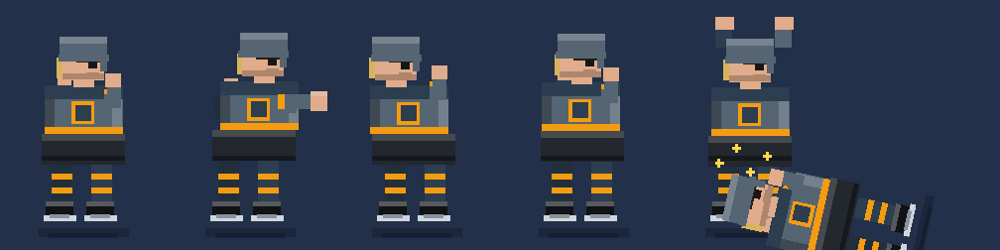
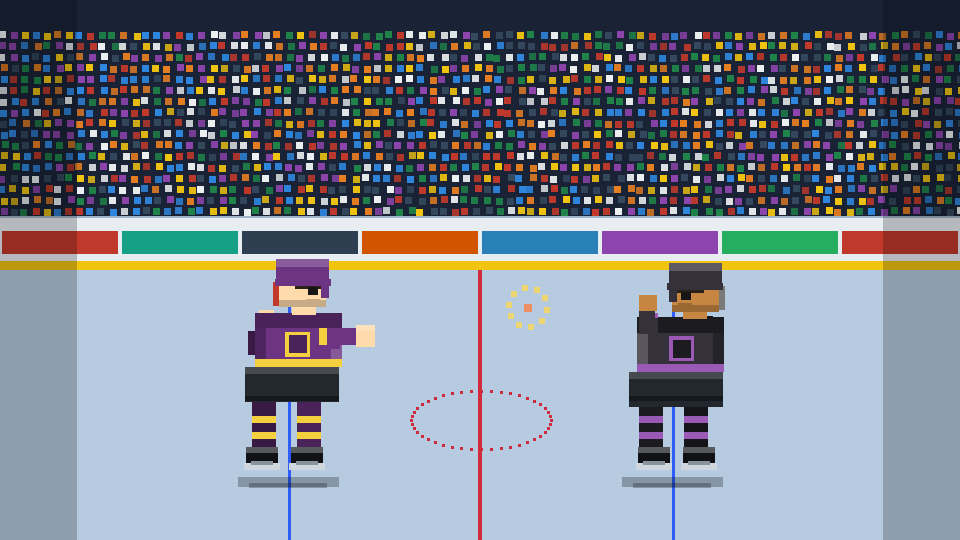
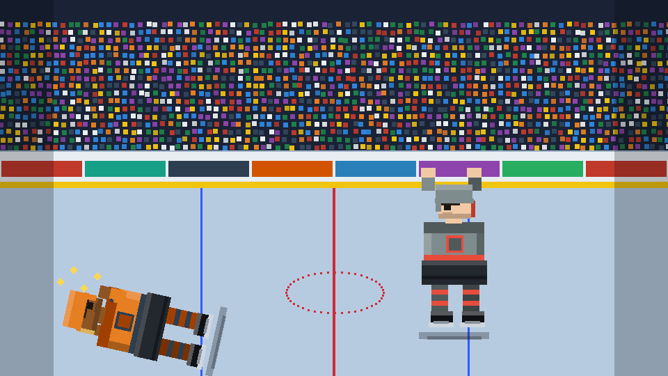

# 🏒🥊 Hockey Fighter

A **Rock-’em-Sock-’em style hockey brawler** — a playable vertical slice. Two
hockey enforcers line up at center ice, drop the gloves, and throw down. The
winner is decided by **weighted random rolls of each fighter’s attributes**, so
favorites win more often but anyone can land the big one.

Unlock fighter “cards,” build a lineup, pick your brawler, size up the matchup,
and watch the fists fly — all rendered with hand-coded 2D pixel sprites and zero
runtime dependencies.

> ⚠️ **Not affiliated with the NHL.** Every team, city, player name, jersey, and
> logo in this game is **fictional and procedurally generated**. Any resemblance
> to real people or organizations is coincidental.



| Center-ice brawl | Knockout! |
| --- | --- |
|  |  |

---

## Run it

It’s a static site — no build step, no `npm install`. You just need a local web
server (ES modules don’t load from `file://`).

```bash
# clone, then from the repo root:
npm start            # serves on http://localhost:8080  (python3 -m http.server)
# — or any static server, e.g.:
npx serve .
```

Open **http://localhost:8080** and start swinging. Progress (roster + coins) is
saved in your browser’s `localStorage`.

## Publish to itch.io

The game is a self-contained HTML5 build (relative paths, no server code, no
external requests), so it drops straight onto itch.io.

```bash
npm run package      # builds hockey-fighter-itch.zip (index.html at the root)
```

Then on itch.io:

1. **Create / edit project → Kind of project: `HTML`**.
2. **Upload** `hockey-fighter-itch.zip` and tick **“This file will be played in
   the browser.”** (itch requires `index.html` at the zip root — this build has
   it there.)
3. **Embed options:** set a viewport around **960 × 600**, enable **Fullscreen
   button**, and tick **Mobile friendly** (the UI is responsive).
4. Save & view. That’s it — no other configuration needed.

Notes: saves use `localStorage`, which works inside itch’s game iframe; if a
visitor’s browser blocks third-party storage the game still plays fine, it just
won’t persist between sessions (handled gracefully). On Windows without the
`zip` CLI, just select `index.html`, `css/`, and `js/` and “Send to →
Compressed (zipped) folder.”

## How to play

1. **OPEN PACK** — spend coins to unlock a randomized fighter card. Rarer cards
   (Common → Rare → Epic → Legendary) roll stronger attributes.
2. **ROSTER** — view your lineup and tap a card to set your active fighter.
3. **FIGHT** — choose a fighter, check the *tale of the tape* (and the odds),
   then **DROP THE GLOVES**.
4. Watch the brawl play out blow-by-blow. **Tap the arena to fast-forward.**
5. Win coins (more for a knockout), open more packs, build a deeper roster.

## Game design

**Six weighted attributes** drive every fighter (range 20–99):

| Attr | Role in the fight |
| --- | --- |
| **STR** Strength | damage per landed punch |
| **SPD** Speed | how often you throw + accuracy / slipping punches |
| **TGH** Toughness | health pool + damage soaked |
| **AGR** Aggression | crit chance, initiative, the “puncher’s chance” |
| **DEF** Defense | chance to block / reduce incoming damage |
| **BAL** Balance | knockdown resistance + decision grit |

A card’s headline **Overall** is a weighted blend tuned to mirror real in-fight
impact, so it’s an honest predictor of who wins.

**The fight engine** (`simulateFight`) plays out as a series of weighted random
exchanges: faster/more aggressive fighters throw more often, strength sets
damage, toughness soaks it, and there’s a rare **flash knockdown** (resisted by
Balance) that gives heavy underdogs a slim path to glory. The result is an event
log that the arena scene replays as animation.

Calibration (higher-Overall fighter’s win rate by Overall gap):

| Overall gap | 0–3 | 4–7 | 8–12 | 13–20 | 21+ |
| --- | --- | --- | --- | --- | --- |
| Favorite wins | ~59% | ~74% | ~86% | ~95% | ~99% |

**Economy:** start with a few fighters + 220 coins. Packs cost 100. Wins pay 60
(+20 for a KO); losses still pay 15 so you’re never fully stuck.

## Project structure

```
hockey_fighter/
├── index.html              # shell: #app root + module entry
├── css/style.css           # arcade/broadcast styling
├── js/
│   ├── main.js             # bootstrap
│   ├── core/               # pure, framework-free, unit-tested game logic
│   │   ├── rng.js          #   seeded RNG + weighted-roll helpers
│   │   ├── attributes.js   #   stat & rarity definitions, Overall formula
│   │   ├── fighter.js      #   procedural fighter + opponent generation
│   │   ├── fight.js        #   the fight simulation engine
│   │   └── roster.js       #   progression + localStorage persistence
│   ├── data/identity.js    # fictional names / teams / palettes
│   ├── render/             # canvas drawing
│   │   ├── pixel.js        #   pixel helpers (shading, mirrored painter)
│   │   ├── player.js       #   parametric pixel hockey fighter (poses)
│   │   └── arena.js        #   rink, crowd, impact bursts
│   └── ui/                 # DOM screens
│       ├── dom.js          #   element helpers + fighter-card component
│       ├── app.js          #   app state machine + all screens
│       └── fight.js        #   arena scene controller (animation loop + HUD)
├── tools/                  # dev-only: render sprites to PNG without a browser
├── test/                   # node --test suites for the core engine
└── assets/previews/        # generated showcase images
```

The **core logic is intentionally decoupled from the DOM** — it’s pure functions
driven by an injected RNG, which is why it’s deterministic and testable.

## Testing

```bash
npm test     # node --test — 28 tests covering RNG, generation, and the engine
```

The suite verifies the weighting is correct: stronger fighters win clearly more
often (but not *always*), identical fighters split ~50/50, KOs drive HP to zero,
higher rarities roll higher, and every simulation is deterministic per seed.

## Dev tools

No headless browser? No problem. The canvas art can be rendered to PNG in pure
Node (it’s all axis-aligned rectangles):

```bash
npm run preview   # writes assets/previews/{sprites,arena,knockout}.png
```

## Roadmap (beyond the slice)

- Sound (organ stings, crowd, the bell)
- Fighter XP / leveling and signature moves
- Tournaments & a season ladder vs. AI rosters
- Stamina across a fight card; injuries
- More sprite variety (beards, flow, tape jobs, alternate jerseys)

## License

[MIT](LICENSE). All in-game content is fictional; see the disclaimer above.
